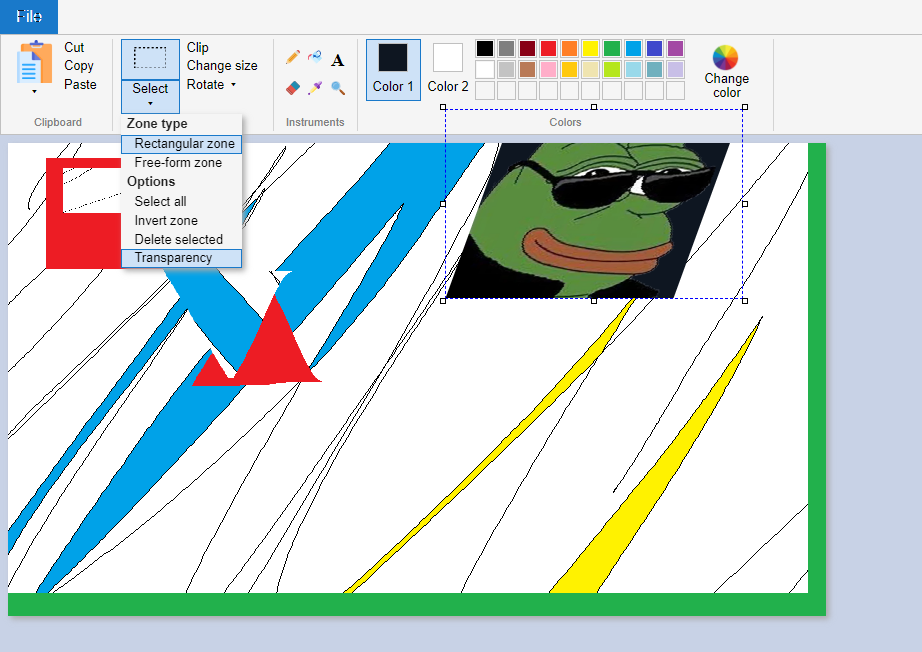

# Paint [WiP]

This is my replica of MS Paint on canvas and [React](https://reactjs.org/). Created using [create-react-app](https://github.com/facebook/create-react-app).

 

Live demo: https://1valdis.github.io/paint/

### What can this thing do?

- [x] File
  - [x] Create
  - [x] Open from disk
  - [x] Save to disk
- [ ] Draw
  - [x] Colors
    - [x] Palette
    - [x] Input
    - [x] Dropper
  - [x] Pen
  - [ ] Brushes
  - [x] Eraser
  - [x] Fill
  - [ ] Shapes
  - [ ] Thickness
  - [ ] Text
  - [ ] Zoom
- [ ] Image
  - [ ] Clipboard
    - [ ] Copy
    - [ ] Paste
    - [ ] Cut
  - [ ] Selection
    - [ ] Paste
      - [ ] From clipboard
      - [ ] From file
    - [ ] Move, resize
    - [ ] Clip selection
    - [ ] Transparent selection

Screenshot:

